## Descripcion General

### DevOps Backend para empresa (ej: Express como ejemplo)

Plantilla end-to-end para entregar un backend a producción con enfoque DevOps: gobernanza, automatización, seguridad y operación continua. El diagrama es reutilizable con cualquier stack backend; ExpressJS es solo un ejemplo de runtime/web framework.

## Infraestructura Tecnica

```text
devops-backend/
|-- 01_ci_cd_github_actions/
|   `-- .github/
|       `-- workflows/
|           `-- ci-cd.yml                               # gates: quality->artifact->deploy
|-- 02_git_y_politicas/
|   |-- .git/
|   |   |-- branches/                                 # main/develop/release (según política)
|   |   `-- merge-strategy.md                        # PR obligatorio + CODEOWNERS + checks
|   `-- codeowners/                                  # (opcional) ownership + revisión
|-- 03_contenerizacion_opcional/
|   |-- docker/
|   |   |-- Dockerfile                                 # opción
|   |   `-- .dockerignore
|   `-- artifacts/                                   # artifact storage (si no hay docker)
|-- 04_infra_hosting_iac/
|   |-- terraform/                                    # IaC: red + IAM + runtime + DB
|   `-- hosting/                                      # cloud (AWS/Azure/GCP) u on-prem
|       |-- staging/
|       `-- production/
|-- 05_alcance_backend_y_codigo/
|   |-- alcance.md                                    # MVP + NFR/SLO + DoD
|   |-- backlog.md                                   # epics->stories con aceptación
|   `-- api-contract/
|       `-- openapi.(yaml|json)                     # contrato API versionado
|-- 06_seguridad_y_waf/
|   |-- authz/
|   |   `-- rbac-abac.md                              # roles/policies
|   |-- secrets-management.md                       # secrets manager o inyección CI
|   `-- waf-rate-limit.md                           # WAF + rate limit + reglas
|-- 07_red_dns_tls/
|   |-- dns/
|   |-- tls/
|   `-- edge-proxy/
|       `-- reverse-proxy-and-lb.md                 # HTTPS + routing + LB/Ingress
|-- 08_secrets_config_por_env/
|   |-- local/
|   |-- dev/
|   |-- staging/
|   `-- production/
|       `-- config-by-env.md                       # variables + cifrado + rotación
|-- 09_datos_backups_y_rollback/
|   |-- db-provision.md                             # motor + migraciones
|   |-- backups.md                                 # periodicidad + retención + restore
|   `-- rollback.md                                # rollback verificado post-deploy
|-- 10_deploy_staging_y_validacion/
|   |-- staging/
|   |   `-- release-plan.md                         # rolling/blue-green + migraciones
|   `-- staging-checks.md                           # smoke + contract checks + health
|-- 11_deploy_produccion_y_aprobaciones/
|   |-- production/
|   |   `-- approval-checklist.md                  # approvals + gating
|   `-- op-run.md                                  # SRE: SLO + escalado + dashboards
|-- 12_observabilidad_y_alertas/
|   |-- logs-metrics-traces/
|   `-- alerting.md                                # umbrales + playbooks por severidad
|-- 13_runbooks/
|   |-- deploy.md
|   `-- rollback.md
```

## Infraestructura Mermaid

### Proyecto pequeño (empresa)

```mermaid
flowchart TB
  A1["1. Idea/Need"] --> A2["2. Alcance backend: API + NFR/SLO"]
  A2 --> A3["3. Backlog + DoD"]
  A3 --> A4["4. Tipo sistema: API HTTP + opc. jobs"]
  A4 --> A5["5. Stack: runtime web + convenciones"]
  A5 --> A6["6. Repo/Git: trunk+feature; PR + CI checks"]
  A6 --> A7["7. Desarrollo base: contratos + validación + error + HC"]
  A7 --> A8["8. Persistencia: DB (motor elegido) o estado efímero/externo"]
  A8 --> A9["9. Contrato API: REST vX + OpenAPI"]
  A9 --> A10["10. Seguridad: AuthN/AuthZ + rate limit; CORS/headers (+CSRF opc.)"]
  A10 --> A11["11. Integraciones: adaptadores + timeout/retry; idempotencia si aplica"]
  A11 --> A12["12. Tests: unit + integration + contract + E2E smoke"]
  A12 --> A13["13. Contenerización opcional: Docker + imagen versionada/firmada"]
  A13 --> A14["14. CI/CD: build + scan + deploy gates"]
  A14 --> A15["15. Infra/hosting: PaaS o VM administrada"]
  A15 --> A16["16. Red/publicación: DNS + HTTPS; reverse proxy + LB"]
  A16 --> A17["17. Secrets/config por env: secrets manager/CI; rotación"]
  A17 --> A18["18. Deploy staging: releases versionadas + migraciones seguras"]
  A18 --> A19["19. Validación staging: healthchecks + smoke + logs/metrics"]
  A19 --> A20["20. Deploy producción: gates + rollback plan"]
  A20 --> A21["21. Operación: logs/metrics/alertas + backups + rollback verificado"]
```



### Proyecto grande (empresa)

```mermaid
flowchart TB
  B1["1. Idea/Need"] --> B2["2. Alcance: API + NFR/SLO + compliance"]
  B2 --> B3["3. Backlog: epics->stories + criterios aceptación"]
  B3 --> B4["4. Tipo sistema: API HTTP + workers/colas + jobs"]
  B4 --> B5["5. Stack: arquitectura modular + observabilidad desde inicio"]
  B5 --> B6["6. Repo/Git: main+develop + feature/release; PR obligatorio"]
  B6 --> B7["7. Desarrollo base: contratos + validación + error; HC + logs estructurados"]
  B7 --> B8["8. Persistencia: DB principal + migraciones; copia/backup strategy"]
  B8 --> B9["9. Contrato API: OpenAPI + contract testing"]
  B9 --> B10["10. Seguridad: AuthN/AuthZ (RBAC/ABAC) + rate limit; CORS + CSRF opc. + auditoría"]
  B10 --> B11["11. Integraciones: circuit breaker + idempotencia; reintentos con backoff; tracing"]
  B11 --> B12["12. Tests: unit + integration + contract + E2E smoke; gatillados por CI"]
  B12 --> B13["13. Contenerización opcional: Docker + imagen firmada + HC"]
  B13 --> B14["14. CI/CD: build+scan+sign (+SBOM opc.); deploy staging/prod con gates"]
  B14 --> B15["15. Infra/hosting: cloud (AWS/Azure/GCP) o on-prem; IaC + autoscaling + policy"]
  B15 --> B16["16. Red/publicación: DNS + HTTPS TLS + WAF; reverse proxy + LB/Ingress"]
  B16 --> B17["17. Secrets/config por env: secrets manager/Key Vault + RBAC; rotación"]
  B17 --> B18["18. Deploy staging: blue/green o rolling; migraciones seguras"]
  B18 --> B19["19. Validación staging: healthchecks + smoke + alertas + dashboards"]
  B19 --> B20["20. Deploy producción: aprobaciones + migraciones controladas + post-deploy gates"]
  B20 --> B21["21. Operación SRE: logs/metrics/traces + alertas + SLO; backups y restore probado; rollback verificado"]
```



## Cierre: Información Operativa

El objetivo del repo y del pipeline es garantizar que cada release sea desplegable, auditable y reversible: healthchecks consistentes, secretos por entorno sin exposición, trazabilidad por request, observabilidad operativa (logs/metrics/alertas), y recuperación probada (backups/restore) con runbooks.

