## Descripcion General

### DevOps Backend para un solo developer (ej: Express como ejemplo)

Plantilla end-to-end para un proyecto backend, enfocada en decisiones DevOps y recorrido hasta producción. El stack de backend es intercambiable; ExpressJS se usa solo como ejemplo de runtime/web framework.

## Infraestructura Tecnica

```text
devops-backend/
|-- 01_ci_cd_github_actions/
|   `-- .github/
|       `-- workflows/
|           `-- ci-cd.yml                               # calidad->artefacto->deploy gates
|-- 02_git_y_políticas/
|   |-- .git/
|   |   |-- branches/                                   # main/develop/release (según política)
|   |   `-- merge-strategy.md                          # PR obligatorio + checks requeridos
|   `-- release-policy.md                              # gating staging/prod (si aplica)
|-- 03_contenerizacion_opcional/
|   |-- docker/
|   |   |-- Dockerfile                                  # opción de empaquetado/ejecución
|   |   `-- .dockerignore
|   `-- artifact/                                      # runtime nativo o bundle (alternativa)
|-- 04_infra_hosting/
|   |-- terraform/                                     # IaC opcional (cloud u on-prem)
|   `-- hosting/                                       # PaaS/VM/K8s + recursos runtime
|-- 05_alcance_backend_y_codigo/
|   |-- alcance.md                                     # MVP + NFR/SLO + DoD
|   |-- backlog.md                                     # epics->stories para entrega
|   |-- api-contract/
|   |   `-- openapi.(yaml|json)                        # contrato API + versionado
|   `-- runtime-contract/
|       |-- healthchecks.md                           # liveness/readiness
|       `-- error-policy.md                           # códigos/semántica consistentes
|-- 06_seguridad/
|   |-- authz-policies.md                              # RBAC/ABAC (si aplica)
|   `-- waf-rate-limit.md                              # WAF + rate limit (si aplica)
|-- 07_red_dns_tls/
|   |-- dns/                                           # dominio + rutas
|   |-- tls/                                           # HTTPS/cert mgmt
|   `-- edge-proxy/
|       `-- reverse-proxy-and-lb.md                   # Nginx/ALB/Ingress + routing
|-- 08_secrets_config_por_env/
|   |-- secrets-management.md                         # secrets in CI o secrets manager
|   `-- config-by-env.md                             # local/dev/stage/prod (variables)
|-- 09_deploy_staging_validación/
|   |-- staging/
|   |   `-- release-plan.md                           # versionado + migraciones seguras
|   `-- staging-checks.md                             # smoke + healthchecks + logs/metrics
|-- 10_deploy_produccion_y_operacion/
|   |-- production/
|   |   `-- release-plan.md                           # approvals + ventanas + gating
|   `-- op-run.md                                     # operación: SLO + escalado + dashboards
|-- 11_observabilidad_y_alertas/
|   |-- observability.md                             # logs/metrics/traces + trazas por request
|   `-- alerting.md                                  # umbrales + rutas de alerta
|-- 12_datos_backups_y_rollback/
|   |-- db-provision.md                               # motor + migraciones/si aplica
|   |-- backups.md                                   # periodicidad + retención + restore
|   `-- rollback.md                                  # rollback verificado + post-checks
|-- 13_runbooks/
|   |-- deploy.md
|   `-- rollback.md
```

## Infraestructura Mermaid

### Proyecto pequeño (solo developer)

```mermaid
flowchart TB
  A1["1. Idea/Need"] --> A2["2. Alcance: MVP/NFR"]
  A2 --> A3["3. Backlog + DoD"]
  A3 --> A4["4. Tipo sistema: API HTTP + opc. jobs"]
  A4 --> A5["5. Stack/framework + convenciones"]
  A5 --> A6["6. Repo/Git: main + PRs; CI por PR"]
  A6 --> A7["7. Desarrollo base: route->ctrl->svc->repo; validation; error; HC"]
  A7 --> A8["8. Persistencia: DB simple o estado efímero/externo"]
  A8 --> A9["9. Contrato API: REST vX + OpenAPI"]
  A9 --> A10["10. Seguridad: AuthN/AuthZ + rate limit; CORS/headers (+CSRF opc.)"]
  A10 --> A11["11. Integraciones: timeout/retry + idempotencia si aplica"]
  A11 --> A12["12. Tests: unit + integration + contract + E2E smoke"]
  A12 --> A13["13. Contenerización opcional: Docker o runtime nativo"]
  A13 --> A14["14. CI/CD: build + scan + deploy gates"]
  A14 --> A15["15. Infra/hosting: PaaS/VM administrada"]
  A15 --> A16["16. Red: DNS + HTTPS; reverse proxy + LB"]
  A16 --> A17["17. Secrets/config por env: CI secrets + rotación; sin .env en repo"]
  A17 --> A18["18. Deploy staging: migraciones seguras + healthcheck"]
  A18 --> A19["19. Validación staging: smoke + logs/metrics"]
  A19 --> A20["20. Deploy producción: gates + rollback plan"]
  A20 --> A21["21. Operación: alertas + backups + rollback verificado"]
```



### Proyecto grande (solo developer)

```mermaid
flowchart TB
  B1["1. Idea/Need"] --> B2["2. Alcance: API + NFR/SLO priorizados"]
  B2 --> B3["3. Backlog + DoD (operativo)"]
  B3 --> B4["4. Tipo sistema: API HTTP + colas/workers si aporta"]
  B4 --> B5["5. Stack: estructura modular + convenciones"]
  B5 --> B6["6. Repo/Git: main + release/*; PRs con CI + calidad"]
  B6 --> B7["7. Desarrollo base: contratos + validación + error; HC + logs estructurados"]
  B7 --> B8["8. Persistencia: DB principal + migraciones; backups/scripts + restore plan"]
  B8 --> B9["9. Contrato API: REST vX + OpenAPI; contract testing básico"]
  B9 --> B10["10. Seguridad: AuthN/AuthZ (RBAC simple) + rate limit; CORS/headers; auditoría"]
  B10 --> B11["11. Integraciones: adaptadores + timeout/retry + idempotencia; tracing"]
  B11 --> B12["12. Tests: unit + integration + smoke E2E; contratos en CI"]
  B12 --> B13["13. Contenerización opcional: Docker o runtime nativo"]
  B13 --> B14["14. CI/CD: build/test/scan; deploy staging/prod"]
  B14 --> B15["15. Infra/hosting: cloud u on-prem; rolling mínimo"]
  B15 --> B16["16. Red: DNS + HTTPS TLS; reverse proxy gestionado"]
  B16 --> B17["17. Secrets/config: secrets en CI + rotación; sin secretos en repo"]
  B17 --> B18["18. Deploy staging: migraciones seguras + healthcheck"]
  B18 --> B19["19. Validación staging: smoke + métricas/alertas"]
  B19 --> B20["20. Deploy producción: gates (manual si hace falta) + rollback inmediato"]
  B20 --> B21["21. Operación: dashboards + healthchecks; backups + restore probado; rollback verificado"]
```



## Cierre: Entrega a Producción

Antes de promover a producción se valida healthcheck, compatibilidad de migraciones, secretos con rotación habilitada, WAF/rate limit activos (si aplica), dashboards con métricas y alertas operativas, backups con restore probado y rollback con runbook actualizado.

