## Descripcion General

### DevOps Frontend para empresa (ej: React como ejemplo)

Plantilla end-to-end para un frontend listo para empresa: gobernanza, automatizacion, seguridad por capas (cliente/edge), despliegue reversible y operacion continua. Framework/libreria frontend intercambiable; React se usa solo como ejemplo.

## Infraestructura Tecnica

```text
devops-frontend/
|-- 01_ci_cd_github_actions/
|   `-- .github/
|       `-- workflows/
|           `-- ci-cd.yml                              # gates: calidad->artefacto->deploy
|-- 02_git_y_politicas/
|   |-- .git/
|   |   `-- branches/                                 # main/develop/release + protecciones
|   |-- codeowners/                                  # revisión por equipo
|   `-- merge-governance.md                          # approvals + checks obligatorios
|-- 03_contenerizacion_opcional/
|   `-- docker/
|       `-- Dockerfile                               # opcional para builds reproducibles
|-- 04_infra_hosting_iac/
|   |-- terraform/                                   # red, CDN, WAF, almacenamiento de artefactos
|   `-- hosting/
|       |-- staging/
|       `-- production/
|-- 05_frontend_alcance_y_contratos/
|   |-- alcance.md                                   # NFR/SLO + versionado + DoD
|   |-- api-contract/
|   |   `-- openapi.(yaml|json)                      # contrato para cliente/SDK
|   `-- runtime-config/
|       `-- config-contract.md                      # whitelists de env-vars (sin secretos)
|-- 06_seguridad_edge_cliente/
|   |-- headers-security.md                          # CSP/HSTS/XFO/SRI policy (si aplica)
|   |-- edge-waf-rate-limit.md                      # WAF/rate limit en CDN/proxy
|   `-- auth-flow.md                                 # OIDC/JWT + cookies/storage seguro
|-- 07_red_dns_tls_publicacion/
|   |-- dns/
|   |-- tls/
|   `-- edge-proxy/
|       `-- cdn-reverse-proxy.md                  # routing + cache policies + invalidation
|-- 08_secrets_config_por_env/
|   |-- secrets-manager.md                           # Key Vault/Secret Manager/CI secrets
|   `-- config-by-env.md                            # local/dev/staging/prod
|-- 09_tests_gobernados/
|   |-- unit/
|   |-- integration/
|   |-- contract/                                   # contract tests del cliente
|   `-- e2e/
|-- 10_deploy_staging_validacion/
|   |-- staging/
|   |   `-- release-plan.md                         # rollout controlado + invalidation
|   `-- staging-checks.md                           # smoke + RUM + alerting dry-runs
|-- 11_deploy_produccion_gobernado/
|   |-- production/
|   |   `-- release-plan.md                         # approvals + windows + phased rollout
|   `-- op-run.md                                  # SRE: SLO + escalado + dashboards
|-- 12_observabilidad_backups_rollback/
|   |-- observability.md                             # RUM/error tracking + performance
|   |-- alerting.md                                  # thresholds + playbooks
|   |-- artifact-retention.md                       # retencion builds firmados
|   `-- rollback.md                                 # revert de build + purge/invalidation
|-- 13_runbooks/
|   |-- deploy.md
|   `-- rollback.md
```

## Infraestructura Mermaid

### Proyecto pequeño (empresa)

```mermaid
flowchart TB
  A1["1. Idea/Need"] --> A2["2. Alcance: MVP + NFR/SLO + compliance"]
  A2 --> A3["3. Backlog + DoD + criterios de aceptacion"]
  A3 --> A4["4. Tipo sistema: SPA/SSR (segun contexto)"]
  A4 --> A5["5. Stack frontend: modular + convenciones"]
  A5 --> A6["6. Repo/Git: main+develop+release; PR obligatorio"]
  A6 --> A7["7. Desarrollo base: build reproducible + API client + error boundary"]
  A7 --> A8["8. Persistencia: tokens/cookies secure + cache local"]
  A8 --> A9["9. Contrato: OpenAPI + contract tests del cliente"]
  A9 --> A10["10. Seguridad: CSP/HSTS + auth OIDC/JWT + protecciones edge"]
  A10 --> A11["11. Integraciones: analytics/flags (si aplica)"]
  A11 --> A12["12. Tests: unit + integration + e2e smoke"]
  A12 --> A13["13. Contenerizacion opcional: Docker (build reproducible)"]
  A13 --> A14["14. CI/CD: gates + scan + artifact versionado (opcional firma)"]
  A14 --> A15["15. Infra/hosting: CDN + almacenamiento artefactos"]
  A15 --> A16["16. Red: DNS + HTTPS + WAF/rate limit + reverse proxy"]
  A16 --> A17["17. Secrets/config: secrets manager + rotacion; sin secretos en repo"]
  A17 --> A18["18. Deploy staging: releases + purge/invalidation + health checks"]
  A18 --> A19["19. Validacion staging: RUM + smoke + dashboards"]
  A19 --> A20["20. Deploy produccion: approvals + rollout + rollback plan"]
  A20 --> A21["21. Operacion: alertas + performance monitoring + retencion artifacts + rollback verificado"]
```



### Proyecto grande (empresa)

```mermaid
flowchart TB
  B1["1. Idea/Need"] --> B2["2. Alcance: multi-tenant + NFR/SLO + performance budgets"]
  B2 --> B3["3. Backlog: epics->stories + DoD + criterios por release"]
  B3 --> B4["4. Tipo sistema: SSR + PWA + feature flags (si aplica)"]
  B4 --> B5["5. Stack: arquitectura por features + contratos + observabilidad"]
  B5 --> B6["6. Repo/Git: main/develop/release; approvals + CODEOWNERS + checks"]
  B6 --> B7["7. Desarrollo base: i18n, caching, service error handling + tracing RUM"]
  B7 --> B8["8. Persistencia: tokens secure + offline/cache estrategia"]
  B8 --> B9["9. Contrato: OpenAPI + contract tests + versionado estricto"]
  B9 --> B10["10. Seguridad: CSP/HSTS + SRI policy + auth OIDC/JWT"]
  B10 --> B11["11. Integraciones: analytics, experimentos, pagos/webhooks (si aplica)"]
  B11 --> B12["12. Tests: unit + integration + contract + e2e + performance"]
  B12 --> B13["13. Contenerizacion opcional: Docker + signed artifacts"]
  B13 --> B14["14. CI/CD: pipeline multi-etapa + SBOM opcional + deploy gates"]
  B14 --> B15["15. Infra/hosting: cloud multi-region o on-prem equivalente; IaC"]
  B15 --> B16["16. Red: DNS + TLS + WAF/rate limit + ingress routing + LB"]
  B16 --> B17["17. Secrets/config: Key Vault/Secret Manager + rotacion"]
  B17 --> B18["18. Deploy staging: blue/green/rolling + validaciones autom."]
  B18 --> B19["19. Validacion staging: RUM + alertas + smoke"]
  B19 --> B20["20. Deploy produccion: phased rollout + ventanas + rollback inmediato"]
  B20 --> B21["21. Operacion: SRE dashboards + alertas + retencion artifacts + rollback verificado"]
```



## Cierre: Informacion Operativa

Antes de promover a produccion se valida: build determinista, gates de calidad (lint/test/scan), compatibilidad de contratos/API, configuracion por entorno sin secretos en repo, seguridad por capas (CSP/HSTS y politicas edge/WAF si aplica), despliegue en CDN con purge/invalidation correcto, observabilidad (RUM/error tracking + performance) con alertas activas, y rollback operativo via retencion de artifacts (revert + purge).

