## Descripcion General

### DevOps Frontend para un solo developer (ej: React como ejemplo)

Plantilla end-to-end para entregar un frontend a produccion con enfoque DevOps: build reproducible, seguridad, despliegue gobernado y operacion continua. El framework/libreria frontend es intercambiable; React se usa solo como ejemplo.

## Infraestructura Tecnica

```text
devops-frontend/
|-- 01_ci_cd_github_actions/
|   `-- .github/
|       `-- workflows/
|           `-- ci-cd.yml                              # lint/test/build/scan -> deploy gates
|-- 02_git_y_politicas/
|   |-- .git/
|   |   `-- branches/                                 # main + feature/* (o trunk-based)
|   `-- merge-strategy.md                            # PRs con CI + calidad automatica
|-- 03_contenerizacion_opcional/
|   |-- docker/
|   |   `-- Dockerfile                               # opcional para build entornos reproducibles
|-- 04_infra_hosting/
|   |-- hosting/                                      # static hosting + CDN (o alternativa on-prem)
|   |-- deploy-targets/                               # env staging/prod (buckets/servicios)
|   `-- iac/                                           # terraform/ pulido (opcional)
|-- 05_frontend_alcance_y_artifacts/
|   |-- alcance.md                                   # SPA/SSR/PWA + NFR/SLO + DoD
|   |-- runtime-config.md                           # env vars permitido (no secretos)
|   |-- api-contract/
|   |   `-- openapi.(yaml|json)                      # contrato para cliente/SDK
|   `-- build-artifacts/
|       `-- versioning.md                            # nombre build + retention
|-- 06_seguridad_frontend/
|   |-- auth-integration.md                         # OIDC/JWT + almacenamiento de sesion
|   |-- security-headers.md                         # CSP, HSTS, X-Frame-Options, etc.
|   `-- edge-abuse-mitigation.md                   # rate limit/WAF en CDN/proxy (si aplica)
|-- 07_red_dns_tls/
|   |-- dns/                                        # dominio + rutas
|   |-- tls/                                        # certificados + renovacion
|   `-- edge-proxy/
|       `-- cdn-reverse-proxy.md                  # routing + cache policies + invalidation
|-- 08_secrets_config_por_env/
|   |-- local/
|   |-- dev/
|   |-- staging/
|   `-- production/
|       `-- config-by-env.md                       # injection CI + secretos en manager
|-- 09_tests_calidad/
|   |-- unit/
|   |-- integration/
|   `-- e2e/
|-- 10_deploy_staging_validacion/
|   |-- staging/
|   |   `-- release-plan.md                         # upload + purge/cdn invalidation
|   `-- staging-checks.md                           # smoke + bundle sanity + logs RUM
|-- 11_deploy_produccion_operacion/
|   |-- production/
|   |   `-- release-plan.md                         # gates + rollout (si aplica)
|   `-- op-run.md                                   # dashboards + alertas + runbook operativo
|-- 12_observabilidad_backups_rollback/
|   |-- observability.md                             # logs/RUM + error tracking + metricas
|   |-- alerting.md                                  # umbrales + playbooks
|   |-- artifact-retention.md                       # retencion builds para rollback
|   `-- rollback.md                                 # revert build + purge/cdn invalidation
|-- 13_runbooks/
|   |-- deploy.md
|   `-- rollback.md
```

## Infraestructura Mermaid

### Proyecto pequeño (solo developer)

```mermaid
flowchart TB
  A1["1. Idea/Need"] --> A2["2. Alcance: MVP/NFR/SLO"]
  A2 --> A3["3. Backlog + DoD"]
  A3 --> A4["4. Tipo sistema: SPA/SSR/PWA (segun contexto)"]
  A4 --> A5["5. Stack/frontend: runtime web + convenciones"]
  A5 --> A6["6. Repo/Git: main + PRs; CI en cada PR"]
  A6 --> A7["7. Desarrollo base: build reproducible + rutas + env-config"]
  A7 --> A8["8. Persistencia: sesion/token (secure) + cache local (si aplica)"]
  A8 --> A9["9. Contrato: API cliente usando OpenAPI + versionado"]
  A9 --> A10["10. Seguridad: OIDC/JWT + security headers + CSP"]
  A10 --> A11["11. Integraciones: analytics/flags (si aplica)"]
  A11 --> A12["12. Tests: unit + integration + e2e smoke"]
  A12 --> A13["13. Contenerizacion opcional: Docker (solo build)"]
  A13 --> A14["14. CI/CD: build + scan + artefacto versionado"]
  A14 --> A15["15. Infra/hosting: static hosting + CDN (o on-prem)"]
  A15 --> A16["16. Red: DNS + HTTPS + reverse proxy/CDN + cache policies"]
  A16 --> A17["17. Secrets/config por env: injection CI + rotacion"]
  A17 --> A18["18. Deploy staging: upload + purge/invalidation + health checks"]
  A18 --> A19["19. Validacion staging: smoke + bundle sanity + logs RUM"]
  A19 --> A20["20. Deploy produccion: gates + rollback plan"]
  A20 --> A21["21. Operacion: error tracking + alertas + backup/retencion artifacts + rollback verificado"]
```



### Proyecto grande (solo developer)

```mermaid
flowchart TB
  B1["1. Idea/Need"] --> B2["2. Alcance: API-driven + NFR/SLO + performance budgets"]
  B2 --> B3["3. Backlog: epics->stories + criterios de aceptacion"]
  B3 --> B4["4. Tipo sistema: SSR o SPA con PWA + workers (si aplica)"]
  B4 --> B5["5. Stack: modular (features) + contratos + versionado"]
  B5 --> B6["6. Repo/Git: main + release/*; PRs con CI quality"]
  B6 --> B7["7. Desarrollo base: i18n + feature flags + error boundary + metrics"]
  B7 --> B8["8. Persistencia: token seguro + cache + preferencia offline (si aplica)"]
  B8 --> B9["9. Contrato: OpenAPI + contract tests (cliente)"]
  B9 --> B10["10. Seguridad: OIDC/JWT + CSP/HSTS + protecciones edge"]
  B10 --> B11["11. Integraciones: analytics + pagos/webhooks si aplica"]
  B11 --> B12["12. Tests: unit + integration + e2e + performance checks"]
  B12 --> B13["13. Contenerizacion opcional: Docker para build reproducible"]
  B13 --> B14["14. CI/CD: lint/build/test/scan + firmar artifacts (opcional)"]
  B14 --> B15["15. Infra/hosting: CDN multi-region o equivalente; IaC opcional"]
  B15 --> B16["16. Red: DNS + TLS + WAF/rate limit + reverse proxy"]
  B16 --> B17["17. Secrets/config por env: secrets manager + rotacion"]
  B17 --> B18["18. Deploy staging: blue/green o rolling + invalidation"]
  B18 --> B19["19. Validacion staging: RUM dashboards + alertas basicas"]
  B19 --> B20["20. Deploy produccion: gates + rollout + rollback inmediato"]
  B20 --> B21["21. Operacion: alertas + monitoreo rendimiento + retencion artifacts + rollback verificado"]
```



## Cierre: Informacion Operativa

Antes de promover a produccion se valida: build determinista, smoke en staging, compatibilidad de contratos/API, configuracion por entorno sin secretos en repo, seguridad headers/CSP activa, despliegue en CDN con purge/invalidation correcto, observabilidad (RUM/error tracking) con alertas, y rollback operativo via retencion de artifacts.

