## Descripcion General

### DevOps Mobile para empresa (ej: Flutter como ejemplo)

Plantilla end-to-end para empresa: gobernanza de releases, firmado con controles, distribucion consistente (staging/prod), seguridad por capas y operacion continua. Framework mobile intercambiable; Flutter se usa solo como ejemplo.

## Infraestructura Tecnica

```text
devops-mobile/
|-- 01_ci_cd_build_sign_distribucion/
|   `-- .github/
|       `-- workflows/
|           `-- ci-cd.yml                              # gates: build/test/sign -> deploy tracks
|-- 02_git_y_gobernanza/
|   |-- .git/
|   |   `-- branches/                                 # main/develop/release + protecciones
|   |-- codeowners/
|   `-- release-governance.md                        # approvals + checks obligatorios
|-- 03_contenerizacion_opcional/
|   `-- docker/
|       `-- Dockerfile                               # opcional para build reproducible
|-- 04_firma_y_resguardo_certificados/
|   |-- signing-secrets.md                           # secrets de firma en vault/CI
|   |-- certificates-backup.md                      # backup cifrado de certificados/profiles
|   `-- key-rotation.md                              # rotacion planificada
|-- 05_alcance_app_versionado_y_contratos/
|   |-- alcance.md                                   # NFR/SLO + compliance + DoD
|   |-- api-contract/
|   |   `-- openapi.(yaml|json)                      # versionado estricto para el cliente
|   `-- release-versioning.md                       # version codes + changelog
|-- 06_seguridad_app/
|   |-- auth-flow.md                                 # OIDC/JWT + validacion + expiracion
|   |-- secure-storage.md                           # storage seguro + mitigacion de leaks
|   `-- tls-mitigations.md                          # TLS + retries + pinning opcional
|-- 07_integraciones_y_privacidad/
|   |-- crash-analytics.md                           # crash/error tracking + symbol upload
|   |-- analytics.md                                # analitica con compliance (si aplica)
|   `-- push-notifications.md                      # FCM/APNS (si aplica)
|-- 08_red_dns_tls/
|   |-- dns/
|   |-- tls/
|   `-- api-endpoints.md                           # dominios API por env + health
|-- 09_secrets_config_por_env/
|   `-- config-by-env.md                            # injection build + runtime config; sin secretos en repo
|-- 10_deploy_staging_validacion/
|   |-- staging-tracks/
|   |   `-- release-plan.md                        # internal/beta + QA checklist
|   `-- staging-checks.md                           # crash-free sessions + smoke + compatibilidad
|-- 11_deploy_produccion_operacion/
|   |-- production-rollout/
|   |   `-- release-plan.md                        # rollout gradual + approvals + ventanas
|   `-- op-run.md                                   # SRE: alertas + soporte
|-- 12_observabilidad_backups_rollback/
|   |-- observability.md                            # RUM mobile + rendimiento + errores
|   |-- alerting.md                                 # umbrales + playbooks
|   |-- rollback.md                                # rollback de release + revert OTA si aplica
|   `-- retention.md                               # retencion builds + simbolos/sourcemaps
|-- 13_runbooks/
|   |-- deploy.md
|   `-- rollback.md
```

## Infraestructura Mermaid

### Proyecto pequeño (empresa)

```mermaid
flowchart TB
  A1["1. Idea/Need"] --> A2["2. Alcance: NFR/SLO + compliance"]
  A2 --> A3["3. Backlog + DoD + criterios de aceptacion"]
  A3 --> A4["4. Tipo sistema: mobile con sabores (dev/staging/prod)"]
  A4 --> A5["5. Stack: modular + convenciones + contract tests cliente"]
  A5 --> A6["6. Repo/Git: main+develop+release; PR obligatorio"]
  A6 --> A7["7. Desarrollo base: secure token lifecycle + cliente HTTP robusto"]
  A7 --> A8["8. Persistencia: secure storage + cache estrategia"]
  A8 --> A9["9. Contrato: OpenAPI versionado + compatibilidad"]
  A9 --> A10["10. Seguridad: OIDC/JWT + hardening + TLS mitigations"]
  A10 --> A11["11. Integraciones: crash/error tracking + analytics + push"]
  A11 --> A12["12. Tests: unit + integration + smoke + pruebas firmadas"]
  A12 --> A13["13. Contenerizacion opcional: Docker para build reproducible"]
  A13 --> A14["14. CI/CD: build/test/sign + symbols + publish staging track"]
  A14 --> A15["15. Infra/hosting: cuentas store + OTA opcional + secrets de firma"]
  A15 --> A16["16. Red: dominios API + TLS + health endpoints"]
  A16 --> A17["17. Secrets/config por env: injection build + rotacion"]
  A17 --> A18["18. Deploy staging: beta releases + checklist QA"]
  A18 --> A19["19. Validacion staging: crash-free + error rate + smoke"]
  A19 --> A20["20. Deploy produccion: approvals + rollout controlado + rollback plan"]
  A20 --> A21["21. Operacion: dashboards + alertas + retention builds + rollback verificado"]
```



### Proyecto grande (empresa)

```mermaid
flowchart TB
  B1["1. Idea/Need"] --> B2["2. Alcance: NFR/SLO + rendimiento + privacidad"]
  B2 --> B3["3. Backlog: epics->stories + DoD por release"]
  B3 --> B4["4. Tipo sistema: multi-flavor + feature flags + OTA (si aplica)"]
  B4 --> B5["5. Stack: arquitectura modular + versionado estricto"]
  B5 --> B6["6. Repo/Git: main/develop/release + approvals + CODEOWNERS"]
  B6 --> B7["7. Desarrollo base: hardening auth + offline/resiliency + telemetry"]
  B7 --> B8["8. Persistencia: secure storage + migraciones de datos locales (si aplica)"]
  B8 --> B9["9. Contrato: OpenAPI + contract tests del cliente"]
  B9 --> B10["10. Seguridad: OIDC/JWT + storage seguro + TLS + pinning opcional"]
  B10 --> B11["11. Integraciones: crash analytics + alerting + push + experimentos"]
  B11 --> B12["12. Tests: unit + integration + smoke device + validacion firma"]
  B12 --> B13["13. Contenerizacion opcional: Docker para build agents"]
  B13 --> B14["14. CI/CD: pipeline multi-etapa + gates + symbols + publish"]
  B14 --> B15["15. Infra/hosting: store + OTA server + control de acceso"]
  B15 --> B16["16. Red: dominios + TLS + endpoints health"]
  B16 --> B17["17. Secrets/config: secrets manager + rotacion + compliance"]
  B17 --> B18["18. Deploy staging: phased beta + monitoreo en tiempo real"]
  B18 --> B19["19. Validacion staging: crash-free + latencia + error rate"]
  B19 --> B20["20. Deploy produccion: rollout gradual + ventanas + rollback inmediato"]
  B20 --> B21["21. Operacion: SRE dashboards + alertas + retention + rollback verificado"]
```



## Cierre: Informacion Operativa

Antes de producir se valida: build firmado, gates de CI/CD con aprobaciones, configuracion por entorno sin secretos en repo, compatibilidad de contratos/API con el cliente, seguridad de autenticacion (token lifecycle + storage seguro), integraciones de observabilidad activas (crash/error tracking) con alertas, y rollback operativo (revert de release en store y/o rollback OTA si aplica) con restore probado.

