## Descripcion General

### DevOps Mobile para un solo developer (ej: Flutter como ejemplo)

Plantilla end-to-end para entregar una aplicacion mobile a produccion con enfoque DevOps: build reproducible, firmado, distribucion gobernada (staging/prod) y operacion continua. Framework mobile intercambiable; Flutter se usa solo como ejemplo.

## Infraestructura Tecnica

```text
devops-mobile/
|-- 01_ci_cd_build_sign/
|   `-- .github/
|       `-- workflows/
|           `-- ci-cd.yml                              # build/test/sign -> deploy distribucion
|-- 02_git_y_politicas/
|   |-- .git/
|   |   `-- branches/                                 # main + feature/*; PR con CI
|   `-- merge-strategy.md                            # calidad automatica por PR
|-- 03_contenerizacion_opcional/
|   `-- docker/
|       `-- Dockerfile                               # opcional para builds reproducibles
|-- 04_firma_y_certificados/
|   |-- android/
|   |   `-- keystore-backup.md                       # backup cifrado de keystore
|   |-- ios/
|   |   `-- certificates-backup.md                 # backup cifrado de certificados/profiles
|   `-- signing-secrets.md                           # secretos de firma en vault/CI
|-- 05_alcance_app_y_versionado/
|   |-- alcance.md                                   # local/dev/staging/prod + NFR/SLO + DoD
|   |-- api-contract/
|   |   `-- openapi.(yaml|json)                      # contrato para cliente/SDK
|   `-- release-versioning.md                       # version codes + changelog
|-- 06_seguridad_app/
|   |-- auth-flow.md                                 # OIDC/JWT + token handling seguro
|   |-- secure-storage.md                           # Keychain/Keystore + rotacion/expiracion
|   `-- tls-mitigations.md                          # TLS, retries, pinning opcional (si aplica)
|-- 07_integraciones/
|   |-- crash-analytics.md                           # crash/error tracking (ej: Sentry/Firebase)
|   |-- analytics.md                                # eventos + funnels (si aplica)
|   `-- push-notifications.md                      # FCM/APNS (si aplica)
|-- 08_red_dns_tls_api/
|   |-- dns/
|   |-- tls/
|   `-- api-endpoints.md                           # base urls por env + health endpoint
|-- 09_secrets_config_por_env/
|   |-- config-by-env.md                           # injection build + runtime config (sin secretos en app)
|   `-- secrets-rotation.md                        # rotacion de llaves/keys
|-- 10_deploy_staging_validacion/
|   |-- staging-releases/
|   |   `-- release-plan.md                        # build beta + distribucion (TestFlight/Play internal)
|   `-- staging-checks.md                           # smoke en dispositivos + crash-free sessions
|-- 11_deploy_produccion_operacion/
|   |-- production-rollout/
|   |   `-- release-plan.md                        # rollout gradual + gates
|   `-- op-run.md                                   # SLO, alertas, soporte
|-- 12_observabilidad_backups_rollback/
|   |-- observability.md                            # RUM mobile + errores + rendimiento (si aplica)
|   |-- alerting.md                                 # umbrales + playbooks
|   |-- rollback.md                                # rollback de release + revert OTA (si aplica)
|   `-- retention.md                               # retencion builds y simbolos/sourcemaps (si aplica)
|-- 13_runbooks/
|   |-- deploy.md
|   `-- rollback.md
```

## Infraestructura Mermaid

### Proyecto pequeño (solo developer)

```mermaid
flowchart TB
  A1["1. Idea/Need"] --> A2["2. Alcance: MVP/NFR/SLO"]
  A2 --> A3["3. Backlog + DoD"]
  A3 --> A4["4. Tipo sistema: Mobile nativo (Android/iOS)"]
  A4 --> A5["5. Stack mobile: runtime + convenciones (ej: Flutter)"]
  A5 --> A6["6. Repo/Git: main + PRs; CI por PR"]
  A6 --> A7["7. Desarrollo base: app shell + rutas/navegacion + cliente HTTP"]
  A7 --> A8["8. Persistencia: secure storage + cache local (si aplica)"]
  A8 --> A9["9. Contrato: cliente de API desde OpenAPI + versionado"]
  A9 --> A10["10. Seguridad: OIDC/JWT + almacenamiento seguro + TLS"]
  A10 --> A11["11. Integraciones: crash/analytics/push (si aplica)"]
  A11 --> A12["12. Tests: unit + integration + smoke en dispositivos"]
  A12 --> A13["13. Contenerizacion opcional: Docker build agents"]
  A13 --> A14["14. CI/CD: build + tests + sign + distribuccion staging"]
  A14 --> A15["15. Infra/hosting: cuentas store + agentes CI; OTA server opcional"]
  A15 --> A16["16. Red: endpoints API por env + TLS + health checks"]
  A16 --> A17["17. Secrets/config por env: injection de build + rotacion"]
  A17 --> A18["18. Deploy staging: upload beta + releases versionadas"]
  A18 --> A19["19. Validacion staging: smoke + crash-free + logs"]
  A19 --> A20["20. Deploy produccion: rollout controlado + gates"]
  A20 --> A21["21. Operacion: alertas + crash/error tracking + rollback de release + restore probado"]
```



### Proyecto grande (solo developer)

```mermaid
flowchart TB
  B1["1. Idea/Need"] --> B2["2. Alcance: NFR/SLO + rendimiento + compliance"]
  B2 --> B3["3. Backlog: epics->stories + criterios de aceptacion"]
  B3 --> B4["4. Tipo sistema: Mobile con sabores + feature flags (si aplica)"]
  B4 --> B5["5. Stack: arquitectura modular + convenciones + contract tests cliente"]
  B5 --> B6["6. Repo/Git: main + release/*; PRs con CI calidad"]
  B6 --> B7["7. Desarrollo base: secure token lifecycle + offline/cache estrategia"]
  B7 --> B8["8. Persistencia: storage seguro + sincronizacion y fallback"]
  B8 --> B9["9. Contrato: OpenAPI + versionado estricto + compatibilidad"]
  B9 --> B10["10. Seguridad: OIDC/JWT + hardening + TLS mitigations"]
  B10 --> B11["11. Integraciones: crash/analytics/notifications + reintentos"]
  B11 --> B12["12. Tests: unit + integration + smoke + pruebas de firma/packaging"]
  B12 --> B13["13. Contenerizacion opcional: Docker para entornos reproducibles"]
  B13 --> B14["14. CI/CD: build/test/sign + symbols + publish staging/prod"]
  B14 --> B15["15. Infra/hosting: store + (OTA opc.) + secretos firma"]
  B15 --> B16["16. Red: dominios APIs + TLS + health endpoint"]
  B16 --> B17["17. Secrets/config por env: rotacion + config por sabores"]
  B17 --> B18["18. Deploy staging: phased beta + monitoreo"]
  B18 --> B19["19. Validacion staging: crash-free + latencia + error rate"]
  B19 --> B20["20. Deploy produccion: rollout gradual + rollback inmediato"]
  B20 --> B21["21. Operacion: alertas + dashboards + retencion de builds + rollback verificado"]
```



## Cierre: Informacion Operativa

Antes de produccion se valida: build firmado, configuracion por env sin secretos en repo, smoke en staging, compatibilidad de contratos/API, seguridad (token lifecycle + storage seguro), integraciones de observabilidad activas (crash/error tracking), y un plan de rollback (revert de release y/o rollback OTA si aplica) con restauracion probada.

